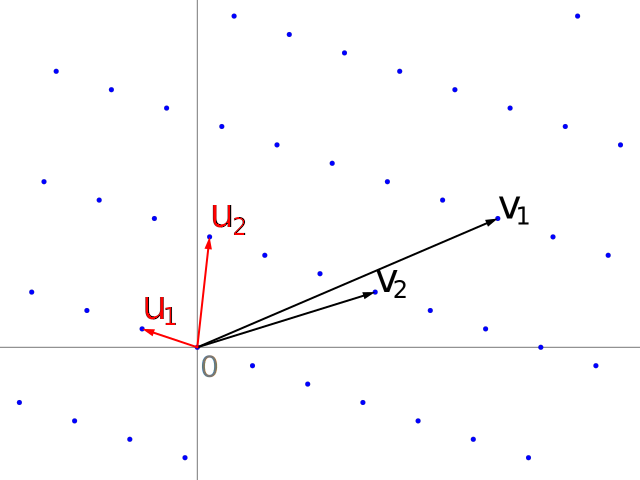

```@meta
CurrentModule = MinkowskiReduction
DocTestSetup = quote
    using MinkowskiReduction
    using LinearAlgebra
end
```




*Image: `Lattice-reduction.svg` by Catslash (Wikimedia Commons, public domain).* In this picture, the lattice is by integer linear combinations `v1` and `v2`. But these basis vectors are much longer than is necessary. `u1` and `u2` do the job just as well, but are shorter. In fact, they are the shortest possible basis vectors for this lattice.

# Tutorial: reducing your first lattice
This tutorial takes you from a fresh Julia session to a completed
Minkowski reduction of a three-dimensional lattice. By the end you will
have:

1. called `mink_reduce` on a skewed cubic basis and recovered the
   orthonormal one,
2. inspected every element of the function's return value,
3. verified the change-of-basis relationship `R == M * P`,
4. reduced a non-cubic (hexagonal) lattice,
5. confirmed that the output is, in fact, Minkowski reduced.

This is the only piece of the documentation that is designed to be read
straight through. For short recipes aimed at particular tasks, see the
[How-to guides](how-to.md). For the theory behind what the function
does, see [Explanation](explanation/algorithm.md).

## Setup

Add the package and load it:

```julia
julia> using Pkg

julia> Pkg.add("MinkowskiReduction")

julia> using MinkowskiReduction

julia> using LinearAlgebra      # for det(), used below
```

## Step 1 — your first reduction

Consider a cubic lattice whose third basis vector has been skewed into
the body diagonal. In other words, the third basis vector includes the first two basis vectors. (Subtracting them from the third basis vector, makes it shorter without destroying its linear independence.)

```jldoctest tutorial
julia> M = [1.0  0.0  1.0;
            0.0  1.0  1.0;
            0.0  0.0  1.0]
3×3 Matrix{Float64}:
 1.0  0.0  1.0
 0.0  1.0  1.0
 0.0  0.0  1.0
```

The columns of `M` are the three basis vectors defining the lattice; together they span exactly the
same lattice as the orthonormal basis `(e₁, e₂, e₃)`. Reduce it:

```jldoctest tutorial
julia> R, P = mink_reduce(M);

julia> R
3×3 Matrix{Float64}:
 1.0  0.0  0.0
 0.0  1.0  0.0
 0.0  0.0  1.0
```

`R` is the reduced basis. The algorithm has found the orthonormal basis
we expected.

## Step 2 — what `mink_reduce` returns

The matrix form returns a 2-tuple `(R, P)`. `R` is the reduced basis;
`P` is a 3×3 integer matrix that records **how the reduction got
there**:

```jldoctest tutorial
julia> P
3×3 Matrix{Int64}:
 1  0  -1
 0  1  -1
 0  0   1
```

Each column of `P` expresses one column of `R` as an integer
combination of columns of `M`. Reading column 3 off: the new third
vector is `0·M[:,1] + 0·M[:,2] + 1·M[:,3] − 1·M[:,1] − 1·M[:,2]`, i.e.
`M[:,3] − M[:,1] − M[:,2]`, which is exactly `(0,0,1)` — the original
skewed body-diagonal vector minus the two orthogonal vectors.

This relationship holds exactly as a matrix equation:

```jldoctest tutorial
julia> M * P == R
true
```

`P` is what lets you transport anything expressed in the old basis
(atomic positions, symmetry operations, reciprocal vectors) into the
reduced one. The [how-to guide](how-to.md) on transforming atomic
positions shows this in context.

The transform is always unimodular (`|det(P)| = 1`):

```jldoctest tutorial
julia> abs(det(P))
1.0
```

## Step 3 — the three-vector form

If your basis is stored as three vectors (instead of the columns of a matrix),
there is an alternative entry point:

```jldoctest tutorial
julia> U = [1.0, 0.0, 0.0]; V = [0.0, 1.0, 0.0]; W = [1.0, 1.0, 1.0];

julia> U′, V′, W′, P, n = mink_reduce(U, V, W);

julia> U′, V′, W′
([1.0, 0.0, 0.0], [0.0, 1.0, 0.0], [0.0, 0.0, 1.0])

julia> n
1
```
The three-vector form returns five values rather than two: the three
reduced vectors, the same integer transform `P`, and the **iteration
count** `n` (the number of outer-loop passes the algorithm took). Short
counts mean the input was already nearly reduced; counts in the mid-to
-high teens indicate a deeply-skewed input. This should never happen with typical inputs and outputs of a DFT code. (A built-in cap stops the
loop at 29 iterations and raises an error — see
[Explanation → Algorithm](explanation/algorithm.md) for why that number.)

## Step 4 — a trickier starting basis

The reduction is unaffected by how skewed the input is, as long as the
lattice it spans is the same. Here is a horribly skewed basis for the
same simple cubic lattice — the columns are long integer lattice
vectors whose nearest-orthonormal form is far from obvious by eye:

```jldoctest tutorial
julia> M = [292755045568446  -214311567528244   292755045568445;
           -214311567528244   156886956080403  -214311567528244;
            292755045568445  -214311567528244   292755045568446];

julia> R, _ = mink_reduce(M);

julia> R
3×3 Matrix{Float64}:
 0.0  -1.0   0.0
 0.0   0.0  -1.0
 1.0   0.0   0.0
```

Same lattice as the first example; the reduced basis is again simple
cubic — three orthonormal lattice vectors — but this time the algorithm
returned them with different signs and axis order. That is not a
mistake: for any highly-symmetric lattice there are multiple
Minkowski-reduced bases, and which one you get depends on tiny details
of the input and of floating-point rounding. This is *non-uniqueness*
in action; see [Explanation → Non-uniqueness](explanation/non-uniqueness.md).

## Step 5 — a non-cubic lattice

Of course, the algorithm handles arbitrary 3D
lattices, not just cubic ones. Here is a hexagonal basis with lattice
parameter `a = 1` and `c/a = √(8/3)` (the ideal hcp ratio):

```jldoctest tutorial
julia> a1 = [1.0, 0.0, 0.0];

julia> a2 = [1.5, √3/2, 0.0];

julia> a3 = [0.0, 0.0, √(8/3)];

julia> U, V, W, _, _ = mink_reduce(a1, a2, a3);

julia> (U, V, W)
([0.5, 0.8660254037844386, 0.0], [0.5, -0.8660254037844386, 0.0], [0.0, 0.0, 1.632993161855452])
```

The reduced basis consists of two in-plane vectors 120° apart (norm 1)
and one perpendicular `c`-axis vector (norm ≈ 1.633). The algorithm
has replaced the skewed `a2` with its shorter equivalent
`a2 − a1 = (0.5, √3/2, 0)`.

## Step 6 — verify the output

`is_mink_reduced` checks all twelve inequalities that define a
Minkowski-reduced basis. It should return `true` for anything
`mink_reduce` produces:

```jldoctest tutorial
julia> is_mink_reduced(U, V, W)
true
```

(The full list of twelve conditions is in
[Reference → The 12 Minkowski conditions](reference/conditions.md).)

## Where to go next

- For specific tasks — transforming atoms, computing orthogonality
  defect, reducing 2D sublattices, generating test inputs — see
  [How-to guides](how-to.md).
- For the function signatures and return values in detail, see the
  [API reference](reference/api.md).
- To understand **why** the algorithm works (and why its output is not
  quite unique), see [Explanation](explanation/algorithm.md).
